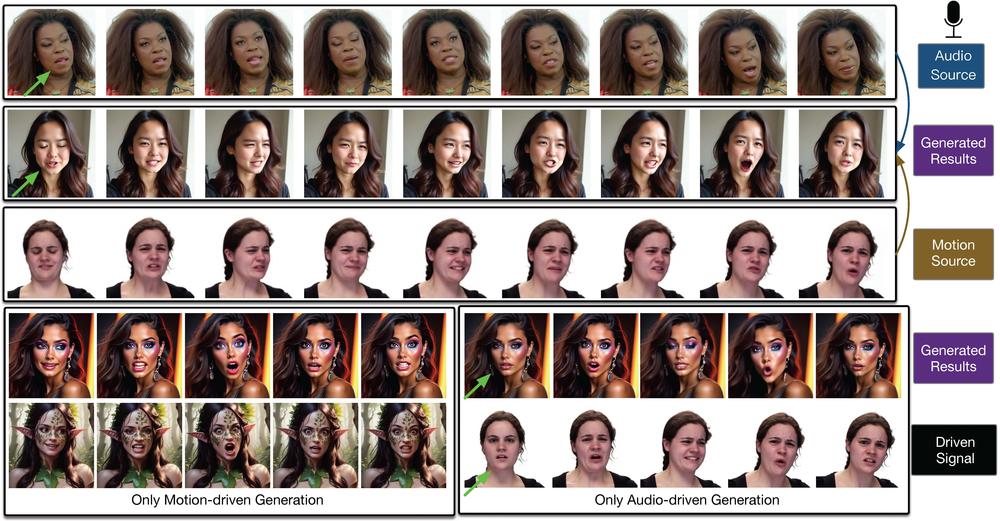

## :book: Audio-visual Controlled Video Diffusion with Masked Selective State Spaces Modeling for Natural Talking Head Generation (ICCV 2025)


> [[Paper](https://arxiv.org/abs/2504.02542)] &emsp; [[Project Page](https://harlanhong.github.io/publications/actalker/index.html)]  &emsp; [[HuggingFace](https://huggingface.co/papers/2504.02542)]<br>
<!-- > [Fa-Ting Hong](https://harlanhong.github.io), [Longhao Zhang](https://dblp.org/pid/236/7382.html), [Li Shen](https://scholar.google.co.uk/citations?user=ABbCaxsAAAAJ&hl=en), [Dan Xu](https://www.danxurgb.net) <br> -->
<!-- > The Hong Kong University of Science and Technology, Alibaba Cloud -->
> [Fa-Ting Hong](https://harlanhong.github.io)<sup>1,2</sup>, Zunnan Xu<sup>2,3</sup>, Zixiang Zhou<sup>2</sup>, Jun Zhou<sup>2</sup>, Xiu Li<sup>3</sup>, Qin Lin<sup>2</sup>, Qinglin Lu<sup>2</sup>, [Dan Xu](https://www.danxurgb.net)<sup>1</sup> <br>
> <sup>1</sup>The Hong Kong University of Science and Technology<br>
> <sup>2</sup>Tencent<br>
> <sup>3</sup>Tsinghua University


:triangular_flag_on_post: **Updates**  

🎉 **Paper accepted at ICCV 2025!** 

&#9745; arXiv paper is available [here](https://arxiv.org/abs/2504.02542)

🔧 **Project Status**: We are continuously organizing the open-source release. Pre-trained checkpoints will be released gradually. Stay tuned!

## Framework 


## :gear: Installation

### System Requirements
- **Python**: 3.10
- **CUDA**: 11.8 (recommended) or 12.1+
- **GPU Memory**: 24GB+ VRAM (H100/A100 recommended)
- **System RAM**: 32GB+ 
- **Storage**: 20GB+ available space
- **OS**: Linux (Ubuntu 20.04+ recommended)
- **FFmpeg**: Required for video processing

### Hardware Performance
| GPU Model | VRAM | Inference Speed | Batch Size | Notes |
|-----------|------|----------------|------------|-------|
| NVIDIA H100 | 80GB | ~6min/25steps | 1 | Recommended |
| NVIDIA A100 | 40GB | ~8min/25steps | 1 | Good performance |
| NVIDIA RTX 4090 | 24GB | ~12min/25steps | 1 | Minimum requirement |
| NVIDIA RTX 3090 | 24GB | ~15min/25steps | 1 | Usable but slow |

### ⚠️ Important Notes

#### Mamba SSM Compatibility
**ACTalker uses Mamba SSM, which has strict environment requirements!** 

✅ **Recommended Configuration (Tested Successfully):**
- CUDA 11.8 + PyTorch 2.0.1 + mamba-ssm 1.2.0.post1
- This combination ensures full Mamba SSM compatibility

❌ **Known Issues:**
- CUDA 12.x versions may have compatibility issues with mamba-ssm
- PyTorch 2.1+ may cause dependency conflicts
- Incorrect version combinations will cause inference failures

### Prerequisites
Before installation, make sure you have FFmpeg and libx264 installed:

**Ubuntu/Debian:**
```bash
sudo apt update
sudo apt install ffmpeg libx264-dev
```

**CentOS/RHEL:**
```bash
sudo yum install epel-release
sudo yum install ffmpeg x264-devel
```

**Conda (Alternative):**
```bash
conda install -c conda-forge ffmpeg x264
```

### Option 1: One-Click Auto Installation 🚀

```bash
git clone https://github.com/harlanhong/ACTalker.git
cd ACTalker
bash install_actalker.sh
```

This script will automatically install all compatible dependency versions, including Mamba SSM.

### Option 2: Using Pre-configured Environment File

```bash
conda env create -f environment.yaml
conda activate actalker
```

### Complete Verification
After installation, run complete environment testing:
```bash
# Verify FFmpeg installation
ffmpeg -version

# Verify basic environment
python -c "import torch; print(f'PyTorch: {torch.__version__}'); print(f'CUDA available: {torch.cuda.is_available()}')"

# Verify Mamba SSM
python -c "from src.models.base.mamba_layer import MAMBA_AVAILABLE; print(f'Mamba available: {MAMBA_AVAILABLE}')"

# Run environment test script
python test_environment.py
```


## :package: Pretrained Models

ACTalker requires pretrained models to function properly. The main model needed is **Stable Video Diffusion**.

### Required Models

#### 1. Stable Video Diffusion (SVD-XT-1.1)
- **Model**: [`stabilityai/stable-video-diffusion-img2vid-xt-1-1`](https://huggingface.co/stabilityai/stable-video-diffusion-img2vid-xt-1-1)
- **Purpose**: Image-to-video generation backbone
- **Size**: ~9.5GB
- **License**: Requires agreement to Stability AI Community License

#### 2. Pretrained checkpoints
- **Model**: [`pretrained Checkpoints`](https://hkustconnect-my.sharepoint.com/:f:/g/personal/fhongac_connect_ust_hk/ErbIGCYPpIRDjFcPgtYXoMABt5HWl5XS_He18Tii4wGQ5A?e=TjmfjR)


## TL;DR:
We propose ACTalker, an end-to-end video diffusion framework for talking head synthesis that supports both single and multi-signal control (e.g., audio, pose, expression). ACTalker uses a parallel mamba-based architecture with a gating mechanism to assign different control signals to specific facial regions, ensuring fine-grained and conflict-free generation. A mask-drop strategy further enhances regional independence and control stability. Experiments show that ACTalker produces natural, synchronized talking head videos under various control combinations.

## Expression Driven Samples
https://github.com/user-attachments/assets/fc46c7cd-d1b4-44a6-8649-2ef973107637

## Audio Dirven Samples
https://github.com/user-attachments/assets/8f9e18a0-6fff-4a31-bbf4-c21702d4da38

## Audio-Visual Driven Samples
https://github.com/user-attachments/assets/3d8af4ef-edc7-4971-87b6-7a9c77ee0cb2

https://github.com/user-attachments/assets/2d12defd-de3d-4a33-8178-b5af30d7f0c2

## :computer: Testing


### Testing (Inference)
Use the following command for inference testing:

```bash
CUDA_VISIBLE_DEVICES=0 python Inference.py --config config/inference.yaml --ref assets/ref.jpg --audio assets/audio.mp3 --video assets/video.mp4 --mode 2
```

**Parameter Description:**
- `--config`: Configuration file path
- `--ref`: Reference image path
- `--audio`: Audio file path  
- `--video`: Video file path
- `--mode`: Inference mode
  - `0`: Audio-only driven
  - `1`: VASA control only
  - `2`: Audio + Expression joint control
- `--exp_name`: Experiment name

### Inference Mode Details

| Mode | Control Signal | Input Requirements | Use Case | Inference Speed |
|------|---------------|-------------------|----------|----------------|
| 0 | Audio only | Reference image + Audio | Speech-driven | Fastest |
| 1 | Expression only | Reference image + Video | Expression transfer | Medium |
| 2 | Audio + Expression | Reference image + Audio + Video | Full control | Slowest |


**Optimization Tips:**
- Use `--overlap` parameter for long video segmented processing
- Adjust `--frames_per_batch` to fit VRAM size
- Use mixed precision to accelerate inference

### :e-mail: Contact

If you have any question or collaboration need (research purpose or commercial purpose), please email `fhongac@connect.ust.hk`.

# 📍Citation 
Please feel free to leave a star⭐️⭐️⭐️ and cite our paper:
```bibtex
@inproceedings{hong2025audio,
  title={Audio-visual controlled video diffusion with masked selective state spaces modeling for natural talking head generation},
  author={Hong, Fa-Ting and Xu, Zunnan and Zhou, Zixiang and Zhou, Jun and Li, Xiu and Lin, Qin and Lu, Qinglin and Xu, Dan},
  booktitle={Proceedings of the IEEE/CVF International Conference on Computer Vision (ICCV)},
  year={2025}
}
``` 
